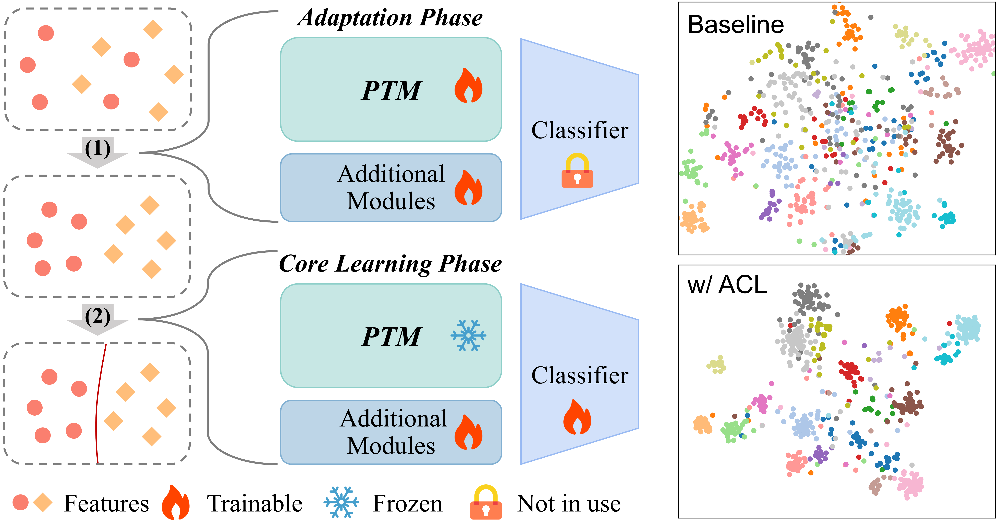

<div align="center">
<h1> Adapt before Continual Learning
</h1>
<div>
    <a>Aojun Lu</a>&emsp;
    <a target='_blank'>Tao Feng</a>&emsp;
    <a href='https://jacobyuan7.github.io/' target='_blank'>Hangjie Yuan</a>&emsp;
    <a>ChunHui Ding</a>&emsp;
    <a href='https://yn-sun.github.io/' target='_blank'>Yanan Sun&#9993</a>&emsp;
</div>
<strong>Accepted to <a href='https://aaai.org/conference/aaai/aaai-26/' target='_blank'>AAAI 2026</a> :partying_face:</strong>

[](https://arxiv.org/abs/2506.03956)
[](https://github.com/byyx666/ACL_code)
[](https://github.com/byyx666/ACL_code)

</div>




> Abstract:
> Continual Learning (CL) seeks to enable neural networks to incrementally acquire new knowledge (plasticity) while retaining existing knowledge (stability). While pre-trained models (PTMs) have become pivotal in CL, prevailing approaches freeze the PTM backbone to preserve stability, limiting their plasticity, particularly when encountering significant domain gaps in incremental tasks. Conversely, sequentially finetuning the entire PTM risks catastrophic forgetting of generalizable knowledge, exposing a critical stability-plasticity trade-off. To address this challenge, we propose Adapting PTMs before the core CL process (ACL), a novel framework that refines the PTM backbone through a plug-and-play adaptation phase before learning each new task with existing CL approaches (e.g., prompt tuning). ACL enhances plasticity by aligning embeddings with their original class prototypes while distancing them from others, theoretically and empirically shown to balance stability and plasticity. Extensive experiments demonstrate that ACL significantly improves CL performance across benchmarks and integrated methods, offering a versatile solution for PTM-based CL.


## 🚀 Quick Start Guide

Welcome! Below are the minimal steps to get the project running.

### ⚠️ Before You Start  
All required datasets are hosted in the open-source toolbox  **[LAMDA-PILOT](https://github.com/LAMDA-CL/LAMDA-PILOT)**.  Follow the instructions there to obtain  ImageNet-R, ImageNet-A, etc.

If there are any questions, please feel free to open an issue or contact with the author: **Aojun Lu** ([aojunlu@stu.scu.edu.cn](mailto:aojunlu@stu.scu.edu.cn))

### 1️⃣ Install Dependencies  

```bash
pip install -r requirements.txt
```


### 2️⃣ Run an Experiment  

```bash
python main.py --warm_ --config ./exps/[MODEL].json
```

Replace `[MODEL]` with any configuration file in `/exps`, e.g.  `l2p_inr` …

⭐ **If this repo helps your research, please give it a star!** ⭐


## Citation

If you find this repo useful, please consider citing our paper.
```bibtex
@misc{lu2025adapt,
  title={Adapt before Continual Learning},
  author={Lu, Aojun and Feng, Tao and Yuan, Hangjie and Ding, Chunhui and Sun, Yanan},
  journal={AAAI},
  year={2026}
}
```


## Acknowledgement

Part of this work's implementation refers to [LAMDA-PILOT](https://github.com/LAMDA-CL/LAMDA-PILOT).
